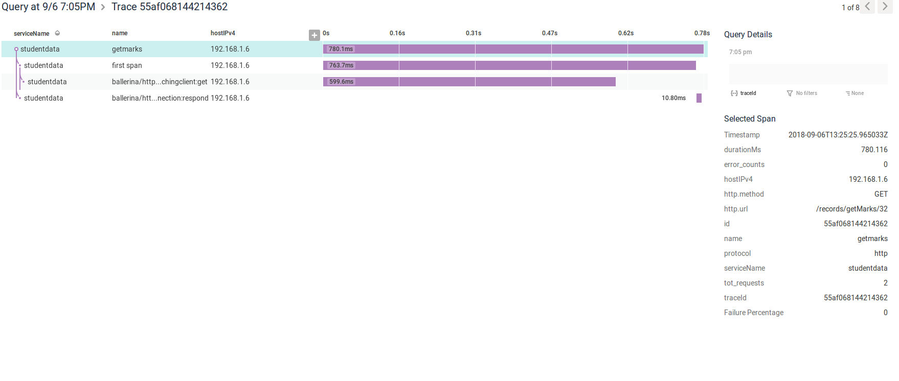
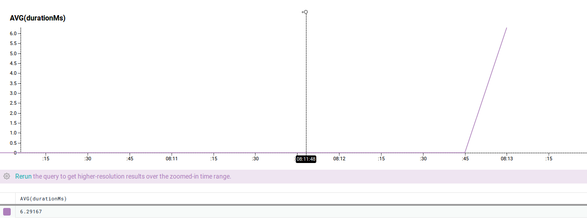
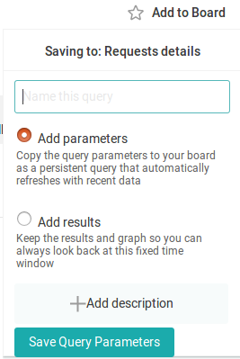
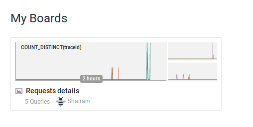
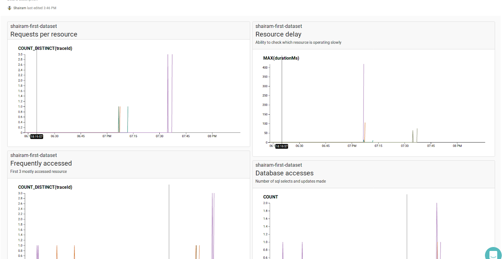
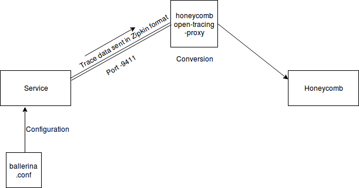

  
## Ballerina- Honeycomb

Honeycomb is a tool used for investigating on how well your system product is working in various conditions (for example - high traffic). Through honeycomb we are able to collect data of your own software which can be broken down into various entities to observe its performance specifically. 

> In this guide you will learn how to integrate your service with Honeycomb in order to interpret your services' performances.
[About Honeycomb](#about-honeycomb)

The following are the sections available in this guide.

- [What you'll build](#what-you’ll-build)
- [Prerequisites](#prerequisites)
- [Implementation](#implementation)
- [Testing](#testing)
- [Deployment](#deployment)


## What you’ll build 

To perform this integration with Honeycomb,  a real world use case of a very simple student management system is used.

.png "Ballerina-Honeycomb")

- **Make Requests** : To perform actions on student  management service, a console based client program has been written in Ballerina for your ease of making requests.

## Prerequisites
 
- [Ballerina Distribution](https://ballerina.io/learn/getting-started/)
- [Docker](https://docs.docker.com/engine/installation/)
- MYSQL
- A Text Editor or an IDE 

## Implementation

> If you want to skip the basics, you can download the GitHub repo and continue from the "Testing" section.

### Implementing database
 - Start MYSQL server in your local machine.
 - Create a database with name `testdb` in your MYSQL localhost. If you want to skip the database implementation, then directly import the [testdb.sql]() file into your localhost. You can find it in the Github repo.
 
 
 ```

### Create the project structure
        
 For the purpose of this guide, let's use the following package structure.
        
    
            ballerina-honeycomb
             └── guide
                ├── students
                │   ├── student_management_service.bal
                │   ├── student_marks_management_service.bal
                │   ├── main.bal  
                |   └── Client_service
                |         └── client_main.bal
                └── ballerina.conf
        

- Create the above directories in your local machine, along with the empty `.bal` files.

- You have to add the following lines in your `ballerina.conf` to send the service traces to Honeycomb in Zipkin format using Opentracing.

```ballerina
[b7a.observability.tracing]
enabled=true
name="zipkin"

[b7a.observability.tracing.zipkin]
reporter.hostname="localhost"
reporter.port=9411

# Send the spans in V1 format as honeycomb-opentracing-proxy supports on V1
reporter.api.context="/api/v1/spans"
reporter.api.version="v1"


reporter.compression.enabled=false
```

- Then open the terminal and navigate to `ballerina-honeycomb/guide` and run Ballerina project initializing toolkit.

``
   $ ballerina init
``

### Development of student and marks service with Honeycomb

Now let us look into the implementation of the student management with observability.

##### student_management_service.bal

``` ballerina
import ballerina/io;
import ballerina/mysql;
import ballerina/http;
import ballerina/runtime;
import ballerina/observe;
import ballerina/log;


// type Student is created to store details of a student
documentation {
  `Student` is a user defined record type in Ballerina program. Used to represent a student entity


}
type Student record {
    int id,
    int age,
    string name,
    int mobNo,
    string address,

};


endpoint http:Client self {
    url: " http://localhost:9090"
};

//End point for marks details client
endpoint http:Client marksService {
    url: " http://localhost:9191"
};

//Endpoint for mysql client
endpoint mysql:Client testDB {
    host: "localhost",
    port: 3306,
    name: "testdb",
    username: "root",
    password: "",
    poolOptions: { maximumPoolSize: 5 },
    dbOptions: { useSSL: false }
};

//This service listener
endpoint http:Listener listener {
    port: 9090
};


// Service for the Student data service
@http:ServiceConfig {
    basePath: "/records"
}
service<http:Service> StudentData bind listener {

    int errors = 0;
    int req_count = 0;

    @http:ResourceConfig {
        methods: ["POST"],
        path: "/addStudent"
    }
    // addStudents service used to add student records to the system
    addStudents(endpoint httpConnection, http:Request request) {
        // Initialize an empty http response message
        req_count++;
        http:Response response;
        Student stuData;


        var payloadJson = check request.getJsonPayload();
        // Accepting the Json payload sent from a request
        stuData = check <Student>payloadJson;
        //Converting the payload to Student type


        // Calling the function insertData to update database
        // int spanId3 = check observe:startSpan("Update database span", tags = mp);
        json ret = insertData(stuData.name, stuData.age, stuData.mobNo,
            stuData.address);

        // Send the response back to the client with the returned json value from insertData function
        response.setJsonPayload(ret);
        _ = httpConnection->respond(response);

        _ = observe:addTagToSpan(spanId = -1, "tot_requests", <string>req_count);
        _ = observe:addTagToSpan(spanId = -1, "error_counts", <string>errors);
    }

    @http:ResourceConfig {
        methods: ["POST"],
        path: "/viewAll"
    }
    //viewStudent service to get all the students details and send to the requested user
    viewStudents(endpoint httpConnection, http:Request request) {
        req_count++;

        int chSpanId = check observe:startSpan("Check span 1");

        map<string> mp = { "Port": "9090" };
        map<string> mp2 = { "endpoint": "/records/viewAll" };
        http:Response response;
        json status = {};


        // int spanId2 = check observe:startSpan("Database call span");

        var selectRet = testDB->select("SELECT * FROM student", Student, loadToMemory = true);
        //sending a request to mysql endpoint and getting a response with required data table


        table<Student> dt;
        // a table is declared with Student as its type
        //match operator used to check if the response returned value with one of the types below
        match selectRet {
            table tableReturned => dt = tableReturned;
            error e => io:println("Select data from student table failed: "
                    + e.message);
        }


        //student details displayed on server side for reference purpose
        io:println("Iterating data first time:");
        foreach row in dt {
            io:println("Student:" + row.id + "|" + row.name + "|" + row.age);
        }

        // table is converted to json
        var jsonConversionRet = <json>dt;
        match jsonConversionRet {
            json jsonRes => {
                status = jsonRes;
            }
            error e => {
                status = { "Status": "Data Not available", "Error": e.message };
            }
        }
        //Sending back the converted json data to the request made to this service
        response.setJsonPayload(untaint status);
        _ = httpConnection->respond(response);

        _ = observe:finishSpan(chSpanId);
        _ = observe:addTagToSpan(spanId = -1, "tot_requests", <string>req_count);
        _ = observe:addTagToSpan(spanId = -1, "error_counts", <string>errors);

    }

    @http:ResourceConfig {
        methods: ["GET"],
        path: "/testError"
    }
    //viewStudent service to get all the students details and send to the requested user
    testError(endpoint httpConnection, http:Request request) {
        req_count++;

        http:Response response;


        errors++;
        io:println(errors);
        _ = observe:addTagToSpan(spanId = -1, "error_counts", <string>errors);
        _ = observe:addTagToSpan(spanId = -1, "tot_requests", <string>req_count);
        log:printError("error test");
        response.setTextPayload("Test Error made");
        _ = httpConnection->respond(response);

    }


    @http:ResourceConfig {
        methods: ["GET"],
        path: "/deleteStu/{stuId}"
    }
    //deleteStudents service for deleteing a student using id
    deleteStudent(endpoint httpConnection, http:Request request, int stuId) {
        req_count++;
        map<string> mp = { "endpoint": "/records/deleteStu/{stuId}" };

        http:Response response;
        json status = {};


        //calling deleteData function with id as parameter and get a return json object
        var ret = deleteData(stuId);


        io:println(ret);
        //Pass the obtained json object to the request
        response.setJsonPayload(ret);
        _ = httpConnection->respond(response);

        _ = observe:addTagToSpan(spanId = -1, "tot_requests", <string>req_count);
        _ = observe:addTagToSpan(spanId = -1, "error_counts", <string>errors);

    }

    @http:ResourceConfig {
        methods: ["GET"],
        path: "/getMarks/{stuId}"
    }
    // get marks resource for obtaining marks of a particular student
    getMarks(endpoint httpConnection, http:Request request, int stuId) {
        req_count++;
        http:Response response;
        json result;

        int fsp = check observe:startSpan("First span");
        //Self defined span for observability purposes
        var requ = marksService->get("/marks/getMarks/" + untaint stuId);
        //Request made for obtaining marks of the student with the respective stuId to marks Service.
        match requ {
            http:Response response2 => {
                var msg = response2.getJsonPayload();
                // Gets the Json object

                match msg {
                    json js => {
                        result = js;
                    }

                    error er => {
                        log:printError(er.message, err = er);
                    }                }
            }
            error err => {
                log:printError(err.message, err = err);
                // Print any error caused
            }
        }

        _ = observe:finishSpan(fsp);
        // Stopping the previously started span.

        response.setJsonPayload(untaint result);
        //Sending the Json to the client.
        _ = httpConnection->respond(response);

        _ = observe:addTagToSpan(spanId = -1, "tot_requests", <string>req_count);
        _ = observe:addTagToSpan(spanId = -1, "error_counts", <string>errors);
    }

    @http:ResourceConfig {
        methods: ["GET"],
        path: "/view/{stuId}"
    }
    //viewOne service to find the details of a particular student using id;
    viewOne(endpoint httpConnection, http:Request request, int stuId) {
        req_count++;
        http:Response response;
        map<string> mp = { "endpoint": "/view/{studentId}" };

        //findStudent function is called with stuId as parameter and get a return json object
        json result = findStudent(untaint stuId);

        //Pass the obtained json object to the request
        response.setJsonPayload(untaint result);
        _ = httpConnection->respond(response);


        _ = observe:addTagToSpan(spanId = -1, "tot_requests", <string>req_count);
        _ = observe:addTagToSpan(spanId = -1, "error_counts", <string>errors);

    }


}

// Function to insert values to database

documentation {
  `insertData` is a function to add data to student records database

    P{{name}} This is the name of the student to be added.

   P{{age}} Student age

   P{{mobNo}} Student mobile number

   P{{address}} Student address.

   R{{}} This function returns a json object. If data is added it returns json containing a status and id of student added.
            If data is not added , it returns the json containing a status and error message.

}
public function insertData(string name, int age, int mobNo, string address) returns (json) {
    json updateStatus;
    int uid;
    string sqlString =
    "INSERT INTO student (name, age, mobNo, address) VALUES (?,?,?,?)";
    // Insert data to SQL database by invoking update action
    //  int spanId = check observe:startSpan("update Database");
    var ret = testDB->update(sqlString, name, age, mobNo, address);


    // Use match operator to check the validity of the result from database
    match ret {
        int updateRowCount => {


            var result = getId(untaint mobNo);
            // Getting info of the student added

            match result {
                table dt => {
                    while (dt.hasNext()) {
                        var ret2 = <Student>dt.getNext();
                        match ret2 {
                            Student stu => uid = stu.id;     // Getting the  id of the latest student added
                            error e => io:println("Error in get employee from table: "
                                    + e.message);
                        }
                    }
                }

                error er => {
                    io:println(er.message);
                }
            }

            updateStatus = { "Status": "Data Inserted Successfully", "id": uid };
        }
        error err => {
            updateStatus = { "Status": "Data Not Inserted", "Error": err.message };
        }
    }
    return updateStatus;
}


documentation {
  `deleteData` is a function to delete a student's data from student records database

    P{{stuId}} This is the id of the student to be deleted.

   R{{}} This function returns a json object. If data is added it returns json containing a status.
            If data is not added , it returns the json containing a status and error message.

}

// Function to delete a student record with id
public function deleteData(int stuId) returns (json) {
    json status = {};

    string sqlString = "DELETE FROM student WHERE id = ?";

    // Delete existing data by invoking update action
    var ret = testDB->update(sqlString, stuId);
    io:println(ret);
    match ret {
        int updateRowCount => {
            if (updateRowCount != 1){
                status = { "Status": "Data Not Found" };
            }
            else {
                status = { "Status": "Data Deleted Successfully" };
            }
        }
        error err => {
            status = { "Status": "Data Not Deleted", "Error": err.message };
            io:println(err.message);
        }
    }


    return status;


}

documentation {
  `findStudent` is as function to find a student's data from the student record database

    P{{stuId}} This is the id of the student to be found.

   R{{}} This function returns a json object. If data is added it returns json containing a table of data which is converted to json format.
            If data is not added , it returns the json containing a status and error message.

}

//Function to get a student's details using id
public function findStudent(int stuId) returns (json) {
    json status = {};


    string sqlString = "SELECT * FROM student WHERE id = " + stuId;
    // Getting student info of the given ID

    var ret = testDB->select(sqlString, Student, loadToMemory = true);
    //Invoking select operation in testDB


    //Assigning data obtained from db to a table
    table<Student> dt;
    match ret {
        table tableReturned => dt = tableReturned;
        error e => io:println("Select data from student table failed: "
                + e.message);
    }


    //converting the obtained data in table format to json data

    var jsonConversionRet = <json>dt;
    match jsonConversionRet {
        json jsonRes => {
            status = jsonRes;
        }
        error e => {
            status = { "Status": "Data Not available", "Error": e.message };
        }
    }

    return status;
}


documentation {
  `getId` is a function to get the Id of the student added in latest.

    P{{mobNo}} This is the mobile number of the student added which is passed as parameter to build up the query.


   R{{}} This function returns either a table which has only one row of the student details or an error.

}
// Function to get the generated Id of the student recently added
public function getId(int mobNo) returns (table|error) {
    //Select data from database by invoking select action
    var ret2 = testDB->select("Select * FROM student WHERE mobNo = " + mobNo, Student, loadToMemory = true);

    table<Student> dt;
    match ret2 {
        table tableReturned => dt = tableReturned;
        error e => io:println("Select data from student table failed: "
                + e.message);
    }

    return dt;

}


```

Now we will look into the implementation of obtaining the marks of the students from database through another service.


##### student_marks_management_service.bal

``` ballerina
import ballerina / io;
import ballerina / mysql;
import ballerina / http;
import ballerina / runtime;
import ballerina / observe;
import ballerina / log;


type Marks record {
    int student_Id,
    int maths,
    int english,
    int science,

};

endpoint mysql:Client testDB {
host: "localhost",
port: 3306,
name: "testdb",
username: "root",
password: "",
poolOptions: { maximumPoolSize: 5 },
dbOptions: { useSSL: false }
};

// This service listener
endpoint http:Listener listener {
port: 9191
};


// Service for the Student data service
@http:ServiceConfig {
basePath: "/marks"
}
service<http:Service> MarksData bind listener {
@http:ResourceConfig {
methods: ["GET"],
path: "/getMarks/{stuId}"
}
// getMarks resource used to get student's marks
getMarks(endpoint httpConnection, http:Request request, int stuId) {
    http:Response response = new;
    json result = findMarks(untaint stuId);


    //Pass the obtained json object to the requested client
    response.setJsonPayload(untaint result);
    _ = httpConnection->respond(response);
}
}

documentation {
  `findMarks` is a function to find a student's marks from the marks record database

    P{{stuId}} This is the id of the student.

   R{{}} This function returns a json object. If data is found it returns json containing a table of data which is converted to json format.
            If data is not added , it returns the json containing a status and error message.

}

public function findMarks(int stuId) returns (json){
    json status = {};

    io:println("reached");
     int spanId = check observe:startSpan("Select Data"); // Self defined span for observability purpose
    string sqlString = "SELECT * FROM marks WHERE student_Id = " + stuId;     // Getting student marks of the given ID
    io:println(stuId);
    var ret = testDB->select(sqlString,Marks,loadToMemory=true);   //Invoking select operation in testDB


     _ = observe:finishSpan(spanId);    // Stopping the previously started span

    //Assigning data obtained from db to a table
    table<Marks> dt;
    match ret {
        table tableReturned => dt = tableReturned;
        error e => io:println("Select data from student table failed: "
                + e.message);
    }


    //converting the obtained data in table format to json data

    var jsonConversionRet = <json>dt;
    match jsonConversionRet {
        json jsonRes => {
            status = jsonRes;
        }
        error e => {
            status = { "Status": "Data Not available", "Error": e.message };
        }
    }

    io:println(status);
    return status;
}

```

Lets look into the implementation of the client implementation.

##### client_main.bal

``` ballerina
import ballerina/io;
import ballerina/http;
import ballerina/log;

endpoint http:Client studentData {
    url: " http://localhost:9090"
};

function main(string... args) {

    http:Request req = new;
    int operation = 0;
    while (operation != 7) {
        // print options menu to choose from
        io:println("Select operation.");
        io:println("1. Add student");
        io:println("2. View all students");
        io:println("3. Find a student");
        io:println("4. Delete a student");
        io:println("5. Make a mock error");
        io:println("6: Get a student's marks");
        io:println("7. Exit");
        io:println();

        // read user's choice
        string choice = io:readln("Enter choice 1 - 5: ");
        if (!isInteger(choice)){
            io:println("Choice must be of a number");
            io:println();
            continue;
        }

        operation = check <int>choice;

        // Program runs until the user inputs 7 to terminate the process
        if (operation == 7) {
            break;
        }


        //user chooses to add a student
        if (operation == 1) {

            //get student name, age mobile number, address
            var name = io:readln("Enter Student name: ");
            var age = io:readln("Enter Student age: ");
            var mobile = io:readln("Enter mobile number: ");
            var add = io:readln("Enter Student address: ");

            //create the request as json message
            json jsonMsg = { "name": name, "age": check <int>age, "mobNo": check <int>mobile, "address": add };


            req.setJsonPayload(jsonMsg);

            //send the request to students service and get the response from it
            var resp = studentData->post("/records/addStudent", req);
            match resp {
                http:Response response => {
                    var msg = response.getJsonPayload();
                    //obtaining the result from the response received
                    match msg {
                        json jsonPL => {
                            string message = "Status: " + jsonPL["Status"] .toString() + "/n Added Student Id :- " +
                                jsonPL["id"].toString();
                            //Extracting data from json received and displaying
                            io:println(message);
                        }

                        error err => {
                            log:printError(err.message, err = err);
                            //Print error
                        }
                    }
                }

                error err => {
                    log:printError(err.message, err = err);
                    //Print error
                }
            }


        }
        //user chooses to list down all the students
        else if (operation == 2) {

            //sending a request to list down all students and get the response from it
            var requ = studentData->post("/records/viewAll", null);

            match requ {
                http:Response response => {
                    var msg = response.getJsonPayload();
                    //obtaining the result from the response received
                    match msg {
                        json jsonPL => {
                            string message;
                            if (lengthof jsonPL >= 1) {            //validate to check if records are available
                                int i;
                                io:println();
                                // Loop through the received json array and display data
                                while (i < lengthof jsonPL) {

                                    message = "Student Name: " + jsonPL[i]["name"] .toString() + ", " + " Student Age: "
                                        +
                                        jsonPL[i]["age"] .toString();
                                    io:println(message);
                                    i++;
                                }
                                io:println();
                            }
                            else {

                                // Notify user if no records are available
                                message = "Student record is empty";
                                io:println(message);
                            }


                        }

                        error err => {
                            log:printError(err.message, err = err);
                            //Print any error caused
                        }
                    }
                }

                error err => {
                    log:printError(err.message, err = err);
                    //Print any error caused
                }
            }

        }

        // User chooses to find a student by Id
        else if (operation == 3) {

            // Get student id
            var id = io:readln("Enter student id: ");

            // Request made to find the student with the given id and get the response from it
            var requ = studentData->get("/records/view/" + check <int>id);

            match requ {
                http:Response response => {
                    var msg = response.getJsonPayload();
                    //obtaining the result from the response received
                    match msg {
                        json jsonPL => {
                            string message;
                            if (lengthof jsonPL >= 1) {
                                // Validate to check if student with given ID exist in the system
                                message = "Student Name: " + jsonPL[0]["name"] .toString() + " Student Age: " + jsonPL[0
                                    ][
                                    "age"] .toString();
                            }
                            else {
                                message = "Student with the given ID doesn't exist";
                            }

                            io:println();
                            io:println(message);
                            io:println();
                        }

                        error err => {
                            log:printError(err.message, err = err);
                            //Print any error caused
                        }
                    }
                }

                error err => {
                    log:printError(err.message, err = err);
                    // Print any error caused
                }
            }


        }

        // User chooses to delete a student by Id
        else if (operation == 4) {

            // Get student id
            var id = io:readln("Enter student id: ");

            // Request made to find the student with the given id and get the response from it
            var requ = studentData->get("/records/deleteStu/" + check <int>id);

            match requ {
                http:Response response => {
                    var msg = response.getJsonPayload();
                    //obtaining the result from the response received
                    match msg {
                        json jsonPL => {
                            string message;

                            message = jsonPL["Status"].toString();


                            io:println();
                            io:println(message);
                            io:println();
                        }

                        error err => {
                            log:printError(err.message, err = err);
                            //Print any error caused
                        }
                    }
                }

                error er => {
                    io:println(er.message);
                }
            }
        }

        else if (operation == 5) {
            var requ = studentData->get("/records/testError");
            match requ {
                http:Response response => {
                    var msg = response.getTextPayload();
                    //obtaining the result from the response received
                    match msg {
                        string message => {


                            io:println();
                            io:println(message);
                            io:println();
                        }

                        error err => {
                            log:printError(err.message, err = err);
                            //Print any error caused
                        }
                    }
                }

                error er => {
                    io:println(er.message);
                }
            }
        }

        else if (operation == 6){
            // Get student id
            var id = io:readln("Enter student id: ");

            // Request made to get the marks of the student with given id and get the response from it
            var requ = studentData->get("/records/getMarks/" + check <int>id);

            match requ {
                http:Response response => {
                    var msg = response.getJsonPayload();
                    //obtaining the result from the response received
                    match msg {
                        json jsonPL => {
                            string message;
                            if (lengthof jsonPL >= 1) {
                                // Validate to check if student with given ID exist in the system
                                message = "Maths: " + jsonPL[0]["maths"] .toString() + " English: " + jsonPL[0
                                    ][
                                    "english"] .toString() + " Science: " + jsonPL[0]["science"] .toString();
                            }
                            else {
                                message = "Student with the given ID doesn't exist";
                            }

                            io:println();
                            io:println(message);
                            io:println();
                        }

                        error err => {
                            log:printError(err.message, err = err);
                            //Print any error caused
                        }
                    }
                }

                error err => {
                    log:printError(err.message, err = err);
                    // Print any error caused
                }
            }
        }

        else {
            io:println("Invalid choice");
        }
    }
}

function isInteger(string input) returns boolean {
    string regEx = "\\d+";
    boolean isInt = check input.matches(regEx);
    return isInt;
}


```

- Now we have completed the implementation of student management service with marks management service.


## Testing 

### Invoking the student management service

You can start both the services by opening a terminal and navigating to `ballerina-honeycomb/guide`, and execute the following command.

```
$ ballerina run --config <path-to-conf>/ballerina.conf Students
```

 You need to start the honeycomb-opentracing-proxy. This can be done by using docker. Docker is used to pull the image for honeycomb-opentracing-proxy.
 Run the following command.
 
 ```
 docker run -p 9411:9411 honeycombio/honeycomb-opentracing-proxy -k APIKEY -d traces
```
- -k represent the API KEY you will be getting when you sign in to honeycomb account.

- -d represents the dataset you are going to send your trace data to.

 You can observe the service performance by making some http requests to the above services. This is made easy for you as 
 there is a client program implemented. You can start the client program by opening another terminal and navigating to ballerina-honeycomb/guide
 and run the below command
 
 ```
 $ ballerina run Client_Service
 ``` 
 
 After making http request, go to [Honeycomb website](https://honeycomb.io) then move to your dataset..

   When you are in your dataset in Honeycomb UI you get to see a button called `New query`, and when you click on that 
   you can write your own queries on the metrics that you have received.
 - You are expected to see the traces as below when you include traceId in the breakdown category.
 
     
 
 - To view a particular trace click on the traceId column. And you will see as below
 
    
    
 - To view span details with metrics click on a particular span and you are expected to see as below
 
     
     
  You can perform some detailed queries in order to look deep in the performance of your services. For example
  
   - The below query will help you find the number of requests per resource (will include self defined spans as well).
   
            
            Query parameters use for each category:-
            
                          1. BREAK DOWN - name
                          2. CALCULATE PER GROUP - COUNT_DISTINCT(traceId)
                          3. FILTER - name does-not-start-with ballerina/ 
                          
            
         We filter out the other default ballerina resource using the filter query.
         
     
    
   The result of the above query is as below : -
 
   
   
   
   - The below query will help you find the average response time per service.
   
                 Query parameters use for each category:-
            
                        
                        1. CALCULATE PER GROUP - AVG(durationMs)
                        2. serviceName - studentdata
   
                        
                 
   The result of the above query is as follows : -
      
   
   
   
   ##### Honeycomb UI Boards
   
   These queries can be predefined and added to the board so that the live observability can be achieved without building queries multiple times. 
   
   To add a query to a board : -
      
   - Create a board.  You can create a board when you run a query. You will see an option “Add to Board” above the query builder.
   
    
   
     
   -  After creating a board select the board. In this guide a board “Requests details” has been already created. Give a name for your query ,add description to be more clear and save the query
    
    
   
   - You can view your boards by clicking the “My Boards” in the team’s main menu in honeycomb UI.

     
   
   
   -  You can click on any of the boards and run the query for that particular instant.
   
        

   
   
 ## About Honeycomb
 
 Honeycomb is a tool used for investigating on how well your system product is working in various conditions (for example - high traffic). Through honeycomb we are able to collect data of your own software which can be broken down into various entities to observe its performance specifically. 
 

 The observability is being achieved by sending traces to the honeycomb UI, in which various queries are executed in order to analyse various conditions where the service is being used by the clients. 
 
 Traces refers to the series of the flow of events that occurs when a request is being made and a response is given back. 
 
 


For example a client requesting data from the database as above.
E refers to an event.
A trace is the path from E1 to E4.

Traces are further broken down into spans. 
Spans can be defined as a single operation, i.e server requesting from database to obtain data and receives it (E2+E3). 
Spans contain data which can be used for interpreting the performance.

These traces contains metadata (span data) which can be captured by honeycomb and be shown graphically or in raw data.


#### Honeycomb open-tracing proxy

Honeycomb works with the data collected in Zipkin format. This proxy will run in your local machine and collect the zipkin formatted trace data and send to honeycomb. 




